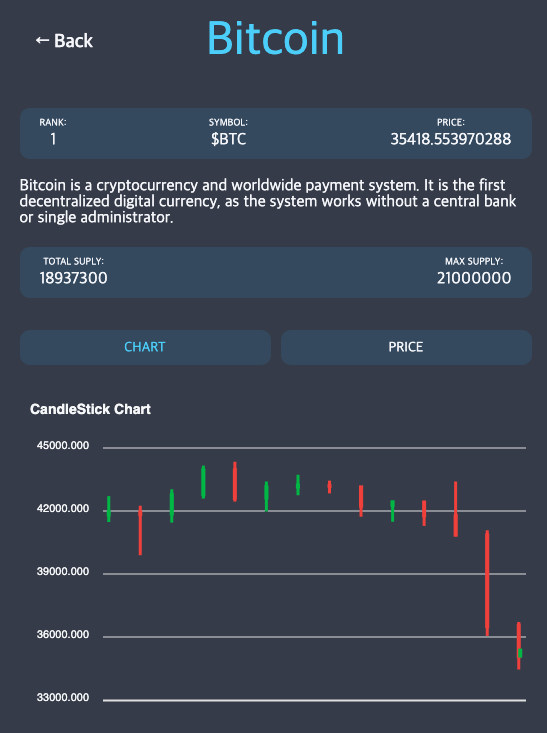

💡 노마드코더 ReactJS 마스터 클래스를 수강하며 배운 내용을 정리하는 공간입니다.

- [블로그 내용정리](https://www.notion.so/React-JS-Master-Class-1c0fbc9f9f3f4b2c8946881ebca7ed1b)

## 만들어 본 것

### 1 코인차트 트래커

1. react-router-dom을 이용해 라우팅 구현.
2. react-query를 이용해 코인 데이터를 패칭해오고 실시간으로 상태관리.
3. Recoil을 이용한 다크모드 구현
